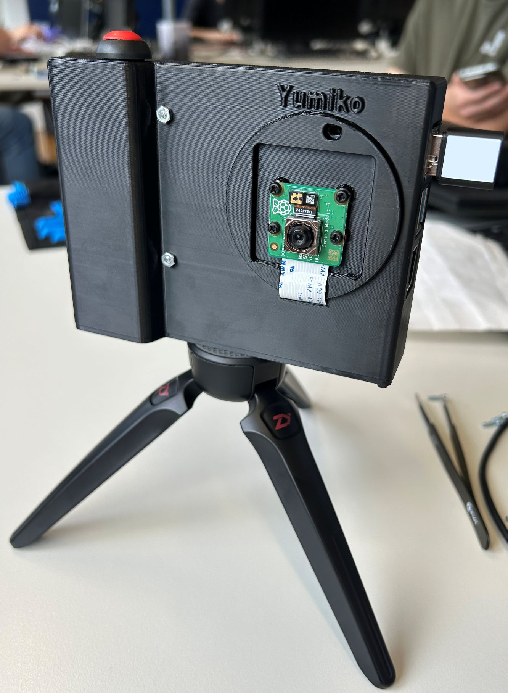

# Yumiko – Smart AI Camera for Raspberry Pi

Yumiko is an AI-powered camera app for the Raspberry Pi, featuring live preview, AI style transfer, gallery navigation, QR code export, and a fullscreen GUI for touchscreens.  
Designed for Pi 4 with Raspberry Pi Camera v3 and a 3.5" LCD touchscreen.

Yumiko comes from the Japanese yume (夢, “dream”) and -ko (子, “child”), meaning “child of the dream.”
The name reflects the project’s core idea: turning ambitious concepts into a practical and funny tool.

We hope you enjoy using and testing our Project!

<p align="center">
  
</p>


Inspiration:
  - [pi-camera](https://github.com/geerlingguy/pi-camera) by [Jeff Geerling](https://github.com/geerlingguy/)
  - [PIKON Camera](https://www.kevsrobots.com/blog/pikon-camera.html) by [Kevin McAleer](https://www.kevsrobots.com)

---

## Features

- Live camera preview (picamera2)
- AI style transfer (OpenAI API)
- Gallery mode with touch navigation
- Style overlay with GIF loading animation
- QR code for image download
- GPIO button control
- Fullscreen GUI for touchscreens

---

### Directory Structure
```
yumiko/
├── camera_app/
│   ├── camera.py             ← Main application
│   ├── start_camera.sh       ← Start script (for autostart)
│   ├── server.py             ← Start script (for flask-server)
│   ├── assets/
│   │   ├── icons/            ← Gallery, QR, magic wand icons, GIFs, etc.
│   │   ├── styles/           ← Style image buttons
│   │   └── test/             ← Test images or debug material
│   ├── stl_files/            ← stl files for camera case
│   ├── photos/               ← Photos + stylized images
│   └── requirements.txt      ← Python dependencies
├── .gitignore               
├── README.md                 
```

---

## Requirements
- Verified OpenAI account with sufficient funds available and a valid API key
- Raspberry Pi 4 model B (2 GB RAM or better)
- Raspberry Pi Camera v3 (other camera modules should work too)
- 3.5 inch GPIO LCD touchscreen (in our case: Joy-IT model)
- Raspberry Pi OS (Debian Bookworm 64-bit)
- microSD card
- 12mm push button
- 2x4 2.54 mm female headers
- USB-C powerbank and USB-C cable to power the Pi
- Screws and nuts:
    - M2.5 x 12 mm, 4 pcs, each with nut (for Pi)
    - M2.5 x 4 mm screws, 4 pcs (for front camera attachment)
    - M2 x 5 mm screws, 4 pcs (for bottom plate)
- 3D printed case (STL files in the corresponding directory)
- melt-in thread insert: 1/4 Inch 20UNC
- Wireless USB Adapter (in our case: D-Link DWA-131 N300)
  

---

## 3D-Printed Enclosure

This custom enclosure is based on [Kevin McAleer's](https://www.kevsrobots.com/blog/pikon-camera.html) and [Jeff Geerling’s](https://github.com/geerlingguy/pi-camera) designs and has been modified to better suit the Yumiko build.

### Modifications

Several changes were made to accommodate additional hardware:

- A **12 mm pushbutton** and a **power bank** have been integrated into the case.
- The enclosure was **enlarged along the X and Y axes** to fit the power bank, which slightly exceeds the original dimensions.
- A **reinforced hole** was added to the bottom of the case to support a **melt-in threaded insert** for tripod mounting.
- An additional **access hole** below the battery allows for easy pressing of the power bank’s power button — making Yumiko simple to turn on and off.

### Parts

The enclosure is split into two components:
- `Main_Case.stl`
- `Bottom.stl`

You can find both STL files inside the [`stl_files/`](/camera_app/stl_files) directory.
## Assembly

- Begin by soldering the two leads of the 12mm pushbutton to the first and last pins on one of the 2x4 female headers. (In this setup, one lead connects to a ground pin and the other to GPIO pin 21. Depending on your  configuration, the GPIO pin may vary.)

- Feed the camera module's ribbon cable through the front slit of the enclosure.

- Mount the camera module inside the case using M2.5 x 4mm screws.
 

- Place the Raspberry Pi into the enclosure so that its ports are aligned with the opening on the left side.

- Secure the Raspberry Pi to the four internal standoffs using M2 x 12mm screws inserted from the outside. Fasten them with nuts on the inside, above the Pi board.

- Connect the ribbon cable from the camera to the Pi’s CSI camera port. Make sure the metal contacts on the ribbon face toward the Pi’s port side.

- Insert the pre-soldered pushbutton header onto the GPIO pins, ensuring that one pin goes to ground and the other to GPIO 21. Carefully bend the wires so they do not press against the display module.

- Attach the Waveshare GPIO TFT display directly onto the Raspberry Pi's GPIO header. It should sit flush on top of the Pi 4 Model B.

- Gently position the camera ribbon cable behind the display to keep everything neat.

- Melt the threaded insert into the bottom plate by using a soldering iron (set to 200–250 °C). Gently heat the insert until it sinks into the hole and fuses with the plastic.

- Finally, secure the bottom cover to the main enclosure using four M2 screws.
---

## Quick Installation

### 1. Flash Raspberry Pi OS

- Use Raspberry Pi Imager to write Raspberry Pi OS 64-bit (Bookworm) to your microSD card.
- Enable SSH and set a username (e.g. `admin`) during flashing.

### 2. First Boot & Basic Setup

```
# Connect via SSH
ssh admin@<IP-address>
```

```
# Update system and install dependencies
sudo apt update
sudo apt install -y python3-pyqt5 python3-opencv libqt5gui5 libqt5widgets5 libqt5core5a libqt5network5 \
    libjpeg-dev libatlas-base-dev git dkms build-essential raspberrypi-kernel-headers hostapd dnsmasq \
    xinput-calibrator
```

### 3. Display Driver

```
git clone https://github.com/goodtft/LCD-show.git
chmod -R 755 LCD-show
cd LCD-show
sudo ./LCD35-show
```
Reboots automatically


To rotate display:
```
cd LCD-show
./rotate.sh 180 #(or 90/270)
```
Also reboots automatically


### 4. Touchscreen Calibration

This step will only be necessary if your touch input is inverted.
```
sudo rm /etc/X11/xorg.conf.d/99-calibration.conf
sudo nano /etc/X11/xorg.conf.d/99-calibration.conf
```
Insert:
```
Section "InputClass"
    Identifier      "calibration"
    MatchProduct    "ADS7846 Touchscreen"
    Option  "Calibration"   "220 3942 3888 200"
    Option  "SwapAxes"      "1"
    Option  "TransformationMatrix" "0 -1 1 -1 0 1 0 0 1"
EndSection
```
Then:
```
# (Optional) Enable VNC
sudo raspi-config  # Interface Options → VNC → Enable
```
```
sudo reboot
```

### 5. Camera Setup

- Connect the camera as per manufacturer instructions.
- Test with:
```
export DISPLAY=:0
libcamera-hello -t 0 --autofocus-mode continuous --qt-preview
```

### 6. Clone & Install Yumiko

```
git clone https://github.com/Marsbitware/yumiko.git
cd yumiko/camera_app/
python3 -m venv venv --system-site-packages
source venv/bin/activate
pip install --upgrade pip
pip install -r requirements.txt
```

### 7. Configure OpenAI API Key

```
nano ~/yumiko/camera_app/.env
```
Add:
```
OPENAI_API_KEY=<your_api_key>
```

### 8. Make Scripts Executable

```
chmod +x ~/yumiko/camera_app/camera.py ~/yumiko/camera_app/server.py ~/yumiko/camera_app/start_camera.sh
```

### 9. Autostart with systemd

```
sudo nano /etc/systemd/system/start_camera.service
```
Insert:
```
[Unit]
Description=Start Camera App on boot
After=multi-user.target
[Service]
ExecStart=/home/admin/yumiko/camera_app/start_camera.sh
Restart=always
User=admin
Environment=DISPLAY=:0
WorkingDirectory=/home/admin/yumiko/camera_app
[Install]
WantedBy=multi-user.target
```
Then:
```
sudo systemctl enable start_camera.service
sudo reboot
```

---

## 10. Hotspot Setup

### Install WiFi Driver

Install WiFi Driver according to your WiFi Adapter. In our case:
```
git clone https://github.com/clnhub/rtl8192eu-linux.git
cd rtl8192eu-linux
sudo nano /home/admin/rtl8192eu-linux/Makefile
```
Edit Makefile to this:
```
CONFIG_PLATFORM_I386_PC = n
CONFIG_PLATFORM_ARM_RPI = y
```
Install drivers:
```
cd /home/admin/rtl8192eu-linux
make clean
make
sudo make install
```

### Configure Network
- Reconfigure the network connection used by the Raspberry Pi to access the internet, as we are switching network managers. The hotspot configuration will be handled at a later stage.
- Ensure that you replace "YourSSID" and "YourPassword" with the appropriate credentials.
- Note: It's easier if you assign a static IP address to the Pi's wlan0 interface on the router.

Connect your Pi to WiFi (Multiple WiFis are possible, you can prioritize them with 
sudo nmcli connection modify SSID1 connection.autoconnect-priority 10
sudo nmcli connection modify SSID2 connection.autoconnect-priority 5
the higher the number, the higher the priority)
```
sudo nmcli dev wifi connect "YourSSID" password "YourPassword" ifname wlan0
```

Make sure the NetworkManager only manages wlan0:
```
sudo nano /etc/NetworkManager/conf.d/unmanaged-wlan1.conf
```

and insert
```
[keyfile]
unmanaged-devices=interface-name:wlan1
```


Configure  hostapd
```
sudo nano /etc/hostapd/hostapd.conf
```

and insert:
```
interface=wlan1
driver=nl80211
ssid=YumikoCam
hw_mode=g
channel=6
wmm_enabled=0
auth_algs=1
ignore_broadcast_ssid=0
wpa=2
wpa_passphrase=yumiko123
wpa_key_mgmt=WPA-PSK
rsn_pairwise=CCMP
```

Configure and move dnsmasq:
```
sudo mv /etc/dnsmasq.conf /etc/dnsmasq.conf.orig
sudo nano /etc/dnsmasq.conf
```

and insert:
```
interface=wlan1
dhcp-range=192.168.50.10,192.168.50.100,1h
domain-needed
bogus-priv
```

Tell the daemon where the hostapd config is:
```
sudo sed -i 's|^#DAEMON_CONF=.*|DAEMON_CONF="/etc/hostapd/hostapd.conf"|' /etc/default/hostapd
```

```
sudo systemctl unmask hostapd
sudo systemctl enable hostapd
sudo systemctl restart hostapd
```

Configure wlan1
```
sudo nano /etc/systemd/network/wlan1.network
```

and insert:
```
[Match]
Name=wlan1

[Network]
Address=192.168.50.1/24
DHCPServer=no
```

Restart everything:
```
sudo systemctl enable systemd-networkd
sudo systemctl restart systemd-networkd
sudo systemctl restart hostapd
sudo systemctl restart dnsmasq
```

Ensure that dnsmasq starts only after hostapd has successfully launched:
```
sudo mkdir -p /etc/systemd/system/dnsmasq.service.d
sudo nano /etc/systemd/system/dnsmasq.service.d/override.conf
```

and insert:
```
[Unit]
After=hostapd.service
Requires=hostapd.service
```

and restart
```
sudo systemctl daemon-reexec
sudo systemctl daemon-reload
sudo systemctl restart dnsmasq
```


### Additional notes
- We recommend creating a QR Code for easy access to the Raspi-Hotspot
- Gallery and style assets are located in ~/yumiko/assets/
- Photos and stylized images are saved in ~/yumiko/camera_app/photos/
- If you are using a different user than admin, make sure to update all relevant paths and usernames in the code and scripts accordingly. This includes things like:
```
File paths (e.g., /home/admin/...)

Systemd service configuration (User=admin)

Virtual environment locations (/home/admin/yumiko/...)

#Failing to update these may cause the application to break or not start properly.
```

---

### Third-Party Assets
Icons used in this project are mostly licensed under the MIT License.  
Source and attribution details:
- [Icon: Arrow](https://www.iconfinder.com/icons/211607/right_arrow_icon)
- [Icon: Magic Wand](https://www.iconfinder.com/icons/9025834/magic_wand_icon)
- [Icon: QR Code](https://www.iconfinder.com/icons/4243314/ux_code_app_qr_icon)
- [Icon: Galery](https://www.iconfinder.com/icons/4706692/camera_equipment_gallery_photography_picture_icon)
- [Icon: Trashcan](https://www.iconfinder.com/icons/8664938/trash_can_delete_remove_icon)

---

<p align="center">

</p>
